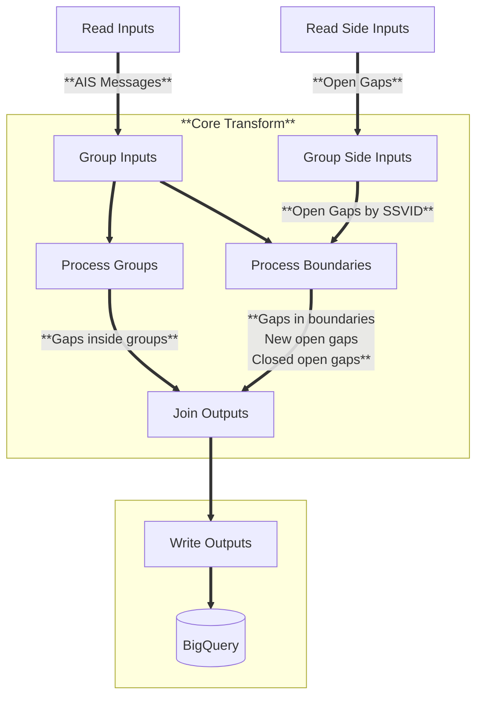

<h1 align="center" style="border-bottom: none;"> pipe-gaps </h1>

<p align="center">
  <a href="https://codecov.io/gh/GlobalFishingWatch/pipe-gaps">
    
  </a>
  <a>
    
  </a>
  <a>
    
  </a>
</p>


Time gap detector for AIS position messages.

Features:
* :white_check_mark: Gaps detection core process.
* :white_check_mark: Gaps detection pipeline.
  - :white_check_mark: command-line interface.
  - :white_check_mark: JSON inputs/outputs.
  - :white_check_mark: BigQuery inputs/outputs.
  - :white_check_mark: Apache Beam integration.
  - :white_check_mark: Incremental (daily) processing.
  - :white_check_mark: Full backfill processing.


[Apache Beam]: https://beam.apache.org
[Apache Beam Pipeline Options]: https://cloud.google.com/dataflow/docs/reference/pipeline-options#python
[Google Dataflow]: https://cloud.google.com/products/dataflow?hl=en
[Google BigQuery]: https://cloud.google.com/bigquery
[bigquery-emulator]: https://github.com/goccy/bigquery-emulator
[configure a SSH-key for GitHub]: https://docs.github.com/en/authentication/connecting-to-github-with-ssh/adding-a-new-ssh-key-to-your-github-account
[docker official instructions]: https://docs.docker.com/engine/install/
[docker compose plugin]: https://docs.docker.com/compose/install/linux/
[examples]: examples/
[git installed]: https://git-scm.com/downloads
[git workflow documentation]: GIT-WORKFLOW.md
[Makefile]: Makefile
[pip-tools]: https://pip-tools.readthedocs.io/en/stable/
[requirements.txt]: requirements.txt
[requirements/prod.in]: requirements/prod.in
[slowly changing dimension]: https://en.wikipedia.org/wiki/Slowly_changing_dimension
[Semantic Versioning]: https://semver.org

## Introduction

<div align="justify">

Not all **AIS** messages that are broadcast by vessels
are recorded by receivers for technical reasons,
such as signal interference in crowded waters,
spatial variability of terrestrial reception,
spatial and temporal variability of satellite reception,
and dropped signals as vessels move from terrestrial coverage
to areas of poor satellite reception.
So, as a result,
it’s not uncommon to see gaps in AIS data,
for hours or perhaps even days [[1]](#1). 

Other causes of **AIS** gaps are:
* The **AIS** transponder is turned off or otherwise disabled while at sea.
* The **AIS** transponder has a malfunction.
* The ships systems are powered off while the vessel is at anchor or in port.

AIS gaps detection is essential to identify 
possible *intentional disabling events*,
which can obscure illegal activities,
such as unauthorized fishing activity or
unauthorized transshipments [[1]](#1)[[2]](#2).

</div>

## Definition of gap

<div align="justify">

We create an **AIS** **gap** event when the period of time between
consecutive known good **AIS** positions from a single vessel,
after de-noise and de-spoofing,
exceeds a configured `threshold` (typically 6 hours).
The `start/end` position messages of the gap are called `OFF/ON` messages,
respectively.

When the period of time between **last** known good position
and the last time of the current day exceeds the `threshold`,
we create an **open gap** event.
In that case, the gap will not have an `ON` message,
until it is **closed** in the future when new data arrives.

</div>

## Usage

### Installation

We still don't have a package in PYPI.

First, clone the repository.
Then run inside a virtual environment
```shell
make install
```
Or, if you are going to use the dockerized process, build the docker image:
```shell
make build
```

In order to be able to connect to BigQuery, authenticate and configure the project:
```shell
docker compose run gcloud auth application-default login
docker compose run gcloud config set project world-fishing-827
docker compose run gcloud auth application-default set-quota-project world-fishing-827
```

### Gap detection core process

> [!NOTE]
> Currently, the core algorithm takes about `(1.75 ± 0.01)` seconds to process 10M messages.  
  Tested on a i7-1355U 5.0GHz processor.


```python
import json
from datetime import timedelta, datetime
from pipe_gaps.core import GapDetector

messages = [
    {
        "ssvid": "226013750",
        "msgid": "295fa26f-cee9-1d86-8d28-d5ed96c32835",
        "timestamp": datetime(2024, 1, 1, 0).timestamp(),
        "receiver_type": "terrestrial",
        "lat": 30.5,
        "lon": 50.6,
        "distance_from_shore_m": 1.0
    },
    {
        "ssvid": "226013750",
        "msgid": "295fa26f-cee9-1d86-8d28-d5ed96c32835",
        "timestamp": datetime(2024, 1, 1, 1).timestamp(),
        "receiver_type": "terrestrial",
        "lat": 30.5,
        "lon": 50.6,
        "distance_from_shore_m": 1.0
    }
]

gd = GapDetector(threshold=timedelta(hours=0, minutes=50))
gaps = gd.detect(messages)
print(json.dumps(gaps, indent=4))
```

### Gap detection pipeline

<div align="justify">

The core process can be integrated with different kinds of inputs and outputs.
Currently JSON and [Google BigQuery] inputs and outputs are supported.
All configured inputs are merged before processing,
and the outputs are written in each output configured.
This pipeline also allows for _side inputs_,
which in this case are existing **open gaps** that can be closed while processing.

The pipeline can be "naive" (without parallelization, useful for development)
or "beam" (allows parallelization through [Apache Beam] & [Google Dataflow]).

</div>

This is an example on how the pipeline can be configured:
```python
from pipe_gaps import pipeline
from pipe_gaps.utils import setup_logger

setup_logger()

pipe_config = {
    "inputs": [
        {
            "kind": "json",
            "input_file": "pipe_gaps/data/sample_messages_lines.json",
            "lines": True
        },
        {
            "kind": "query",
            "query_name": "messages",
            "query_params": {
                "source_messages": "pipe_ais_v3_published.messages",
                "source_segments": "pipe_ais_v3_published.segs_activity",
                "start_date": "2024-01-01",
                "end_date": "2024-01-02",
                "ssvids": [412331104]
            },
            "mock_db_client": False
        }
    ],
    "side_inputs": [
        {
            "kind": "query",
            "query_name": "gaps",
            "query_params": {
                "source_gaps": "scratch_tomas_ttl30d.pipe_ais_gaps",
                "start_date": "2012-01-01"
            },
            "mock_db_client": False
        }
    ],
    "core": {
        "kind": "detect_gaps",
        "threshold": 1,
        "show_progress": False,
        "eval_last": True,
        "normalize_output": True
    },
    "outputs": [
        {
            "kind": "json",
            "output_prefix": "gaps"
        },
        {
            "kind": "bigquery",
            "table": "scratch_tomas_ttl30d.pipe_ais_gaps",
            "description": "Gaps for AIS position messages.",
            "schema": "gaps",
            "write_disposition": "WRITE_APPEND"
        }
    ],
    "options": {
        "runner": "direct",
        "region": "us-east1",
        "network": "gfw-internal-network",
        "subnetwork": "regions/us-east1/subnetworks/gfw-internal-us-east1"
    }
}

pipe = pipeline.create(pipe_type="naive", **pipe_config)
pipe.run()
```

You can see more example [here](config/). 


> [!NOTE]
> The key "options" can be used for custom configuration of each pipeline type.
  For example, you can pass any option available in the [Apache Beam Pipeline Options]. 

> [!CAUTION]
> Date ranges are inclusive for the start date and exclusive for the end date.

### Implementation details

The pipeline is implemented over a (mostly) generic structure that supports:
1. Grouping all inputs by some composite key with **SSVID** and a **time interval**, for example **(SSVID, YEAR)**.
2. Grouping side inputs by **SSVID**.
3. Processing groups from 1.
4. Grouping boundaries (first and last AIS message of each group) by **SSVID**.
5. Processing boundaries from 4 together with side inputs from 2, both grouped by **SSVID**.

Below there is a [diagram](#flow-chart) that describes this work flow.

In the case of the Apache Beam integration with DataFlow runner,
the groups are processed in parallel.

#### Important modules

[detect_gaps.py](pipe_gaps/pipeline/processes/detect_gaps.py): Encapsulates the logic that describes how to process groups, boundaries and side inputs.

[gap_detector.py](pipe_gaps/core/gap_detector.py): Encapsulates the logic that computes gaps in a list of AIS messages.


#### Flow chart



#### BigQuery output schema

The schema for the output **gap events** table in BigQuery
is defined in [pipe_gaps/pipeline/schemas/ais-gaps.json](/pipe_gaps/pipeline/schemas/ais-gaps.json).

#### BigQuery data persistence pattern

<div align="justify">

When an **open gap** is closed,
a new **gap** event is created.

In the case of BigQuery output,
this means that we are using a persistence pattern
that matches the [slowly changing dimension] type 2 
(always add new rows).
In consequence, the output table can contain two gap events with the same `gap_id`:
the old **open gap** and the current **closed _active_ gap**.
The versioning of gaps is done with a timestamp `gap_version` field with second precision.

To query all _active_ gaps,
you will just need to query the last versions for every `gap_id`.
For example:
```sql
SELECT *
    FROM (
      SELECT
          *,
          MAX(gap_version)
              OVER (PARTITION BY gap_id)
              AS last_version,
      FROM `world-fishing-827.scratch_tomas_ttl30d.pipe_ais_gaps_filter_no_overlapping_and_short`
    )
    WHERE gap_version = last_version
```

</div>

### Using from CLI:

Instead of running from python code,
you can use the provided command-line interface.

```shell
(.venv) $ pipe-gaps
usage: pipe-gaps [-h] [-c ] [--pipe-type ] [--save-stats | --no-save-stats] [--work-dir ] [-v] [--threshold ] [--sort-method ] [--show-progress | --no-show-progress]
                 [--eval-last | --no-eval-last] [--norm | --no-norm]

    Detects time gaps in AIS position messages.
    The definition of a gap is configurable by a time threshold.

options:
  -h, --help                           show this help message and exit
  -c  , --config-file                  JSON file with pipeline configuration (default: None).
  --pipe-type                          Pipeline type: ['naive', 'beam'].
  --save-stats, --no-save-stats        If passed, saves some statistics.
  --work-dir                           Directory to use as working directory.
  -v, --verbose                        Set logger level to DEBUG.

pipeline core process:
  --threshold                          Minimum time difference (hours) to start considering gaps.
  --sort-method                        Sorting algorithm.
  --show-progress, --no-show-progress  If passed, renders a progress bar.
  --eval-last, --no-eval-last          If passed, evaluates last message of each SSVID to create an open gap.
  --norm, --no-norm                    If passed, normalizes the output.

Example: 
    pipe-gaps -c config/sample-from-file-1.json --threshold 1.3
```

> [!NOTE]
> Any option passed to the CLI not explicitly documented will be inside "options" key of the configuration
  (see above). 


## References
<a id="1">[1]</a> Welch H., Clavelle T., White T. D., Cimino M. A., Van Osdel J., Hochberg T., et al. (2022). Hot spots of unseen fishing vessels. Sci. Adv. 8 (44), eabq2109. doi: 10.1126/sciadv.abq2109

<a id="1">[2]</a> J. H. Ford, B. Bergseth, C. Wilcox, Chasing the fish oil—Do bunker vessels hold the key to fisheries crime networks? Front. Mar. Sci. 5, 267 (2018).