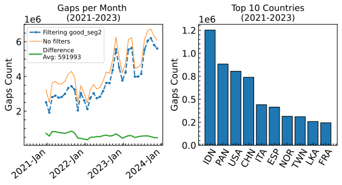
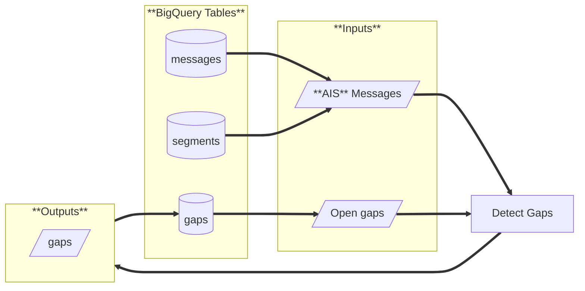

<h1 align="center" style="border-bottom: none;"> pipe-gaps </h1>

<p align="center">
  <a href="https://codecov.io/gh/GlobalFishingWatch/pipe-gaps">
    
  </a>
  <a>
    
  </a>
  <a>
    
  </a>
  <a>
    
  </a>
  <a>
    
  </a>
</p>


Time gap detector for **[AIS]** position messages.

**Features**:
* :white_check_mark: Gaps detection core process.
* :white_check_mark: Gaps detection pipeline.
  - :white_check_mark: command-line interface.
  - :white_check_mark: JSON inputs/outputs.
  - :white_check_mark: BigQuery inputs/outputs.
  - :white_check_mark: Apache Beam integration.
  - :white_check_mark: Incremental (daily) processing.
  - :white_check_mark: Full backfill processing.


[AIS]: https://en.wikipedia.org/wiki/Automatic_identification_system
[Apache Beam]: https://beam.apache.org
[Apache Beam Pipeline Options]: https://cloud.google.com/dataflow/docs/reference/pipeline-options#python
[Google Dataflow]: https://cloud.google.com/products/dataflow?hl=en
[Google BigQuery]: https://cloud.google.com/bigquery
[bigquery-emulator]: https://github.com/goccy/bigquery-emulator
[configure a SSH-key for GitHub]: https://docs.github.com/en/authentication/connecting-to-github-with-ssh/adding-a-new-ssh-key-to-your-github-account
[Dataflow runner]: https://beam.apache.org/documentation/runners/dataflow/
[docker official instructions]: https://docs.docker.com/engine/install/
[docker compose plugin]: https://docs.docker.com/compose/install/linux/
[examples]: examples/
[git installed]: https://git-scm.com/downloads
[git workflow documentation]: GIT-WORKFLOW.md
[Makefile]: Makefile
[pip-tools]: https://pip-tools.readthedocs.io/en/stable/
[requirements.txt]: requirements.txt
[requirements/prod.in]: requirements/prod.in
[segment pipeline]: https://github.com/GlobalFishingWatch/pipe-segment
[slowly changing dimension]: https://en.wikipedia.org/wiki/Slowly_changing_dimension
[Semantic Versioning]: https://semver.org

[ais-gaps.py]: pipe_gaps/queries/ais_gaps.py
[ais-messages.py]: pipe_gaps/queries/ais_messages.py
[core.py]: pipe_gaps/pipeline/beam/transforms/core.py
[detect_gaps.py]: pipe_gaps/pipeline/processes/detect_gaps.py
[gap_detector.py]: pipe_gaps/core/gap_detector.py
[pTransform]: https://beam.apache.org/documentation/programming-guide/#applying-transforms

[results for 2021-2023]: analysis/
[profiling results]: benchmarks/measurement-size-10000000-reps-50.json


**Table of contents**:
- [Introduction](#introduction)
- [Definition of gap](#definition-of-gap)
- [Some results](#some-results)
- [:warning: Important note on grouping messages by `ssvid`](#warning-important-note-on-grouping-messages-by-ssvid)
- [:warning: Important note on not filtering `overlapping_and_short`](#warning-important-note-on-not-filtering-overlapping_and_short)
- [Usage](#usage)
  * [Installation](#installation)
  * [Gap detection low level process](#gap-detection-low-level-process)
  * [Gap detection pipeline](#gap-detection-pipeline)
    + [Running from CLI](#using-from-cli)
    + [BigQuery output schema](#bigquery-output-schema)
    + [BigQuery data persistence pattern](#bigquery-data-persistence-pattern)
- [Implementation details](#implementation-details)
  * [Most relevant modules](#most-relevant-modules)
  * [Flow chart](#flow-chart)
- [References](#references)

## Introduction

<div align="justify">

Not all **AIS** messages that are broadcast by vessels
are recorded by receivers for technical reasons,
such as signal interference in crowded waters,
spatial variability of terrestrial reception,
spatial and temporal variability of satellite reception,
and dropped signals as vessels move from terrestrial coverage
to areas of poor satellite reception.
So, as a result,
it’s not uncommon to see gaps in **AIS** data,
for hours or perhaps even days [[1]](#1). 

Other causes of **AIS** gaps are:
* The **AIS** transponder is turned off or otherwise disabled while at sea.
* The **AIS** transponder has a malfunction.
* The ships systems are powered off while the vessel is at anchor or in port.

AIS gaps detection is essential to identify 
possible *intentional disabling events*,
which can obscure illegal activities,
such as unauthorized fishing activity or
unauthorized transshipments [[1]](#1)[[2]](#2).

</div>

## Definition of gap

<div align="justify">

We create an **AIS** **gap** event when the period of time between
consecutive **AIS** positions from a single vessel exceeds a configured threshold in hours.
The `start/end` position messages of the gap are called `OFF/ON` messages,
respectively.

When the period of time between **last** known position
and the last time of the current day exceeds the threshold,
we create an **open gap** event.
In that case, the gap will not have an `ON` message,
until it is **closed** in the future when new data arrives.

Input position messages are filtered by `good_seg2` field
of the segments table in order to remove noise.
This denoising process happens in the [segment pipeline].

</div>

## Some results

These are some [results for 2021-2023].

<div align="center">



</div>

## :warning: Important note on grouping messages by `ssvid` 

<div align="justify">

The gap detection pipeline fetches **AIS** position messages,
filtering them by `good_seg2`, and groups them by `ssvid`.
Since **we know** different vessels can broadcast with the same `ssvid`,
this can potentially lead to the situation in which we have a gap
with an `OFF` message from one vessel
and a `ON` message from another vessel (or viceversa).
This can happen because currently,
the gap detection process just orders
all the messages from the same `ssvid` by `timestamp`
and then evaluates each pair of consecuive messages.
In consequence,
it will just pick the last `OFF` (or the first `ON`)
message in the chain when constructing a gap,
and we could have have "inconsistent" gaps
in the sense we described above.

We believe those will be a very small
amount of the total gaps,
and we aim in the future to find a solution to this problem.
One option could be to use e.g. `vessel_id`
which has a much higher chance of separating messages from different vessels
that broadcast under the same `ssvid`.

For analyses,
this requires taking care when using gaps for `ssvids` that have multiple `vessel_ids`. 

For usage in products,
a choice has to be made of which of the (potentially) two `vessel_ids` to use
or whether to attribute a gap to both `vessel_ids`
(in which case there would have to be a distinction between `OFF/ON` message),
and also on how to highlight that the gap might refer to multiple vessels.

</div>

## :warning: Important note on not filtering `overlapping_and_short`

<div align="justify">

Gaps are generated including AIS position messages
that are inside `overlapping_and_short` segments.
This was a deliberate choice because removing
`overlapping_and_short` segments can create gaps
where there actually shouldn’t be any. 
An analysis of gaps generated with messages from [2021, 2022, 2023]
with and without the `overlapping_and_short` filter
showed that the results are very similar on an aggregate.

However, within products and many of our analyses we remove:
* segments that are `overlapping_and_short`, and
* `vessel_ids` if all their segments are `overlapping_and_short` (by using `product_vessel_info_summary`).

This means that showing gaps on a map can lead to inconsistent results
since the track or even the vessel might not exist where a gap starts and/or ends.

</div>

## Usage

### Installation

We still don't have a package in PYPI.

First, clone the repository.

Create virtual environment and activate it:
```shell
python -m venv .venv
. ./.venv/bin/activate
```
Install dependencies
```shell
make install
```
Make sure you can run unit tests
```shell
make test
```
Make sure you can build the docker image:
```shell
make build
```

In order to be able to connect to BigQuery, authenticate and configure the project:
```shell
make gcp
```

### Gap detection low level process

<div align="justify">

The gap detection core process takes as input a list of **AIS** messages.
Mandatory fields are:
* `ssvid`
* `timestamp`
* `lat`
* `lon`
* `receiver_type`

Any other fields are not mandatory but can be passed to be included in the gap event.

</div>

> [!NOTE]
> Currently, the algorithm takes about `(3.62 ± 0.03)` seconds to process 10M messages.  
  Tested on a i7-1355U 5.0GHz processor. You can check the [profiling results].


```python
import json
from datetime import timedelta, datetime
from pipe_gaps.core import GapDetector

messages = [
    {
        "ssvid": "226013750",
        "msgid": "295fa26f-cee9-1d86-8d28-d5ed96c32835",
        "timestamp": datetime(2024, 1, 1, 0).timestamp(),
        "receiver_type": "terrestrial",
        "lat": 30.5,
        "lon": 50.6,
    },
    {
        "ssvid": "226013750",
        "msgid": "295fa26f-cee9-1d86-8d28-d5ed96c32835",
        "timestamp": datetime(2024, 1, 1, 1).timestamp(),
        "receiver_type": "terrestrial",
        "lat": 30.5,
        "lon": 50.6,
    }
]

gd = GapDetector(threshold=timedelta(hours=0, minutes=50))
gaps = gd.detect(messages)
print(json.dumps(gaps, indent=4))
```

### Gap detection pipeline

The gaps detection pipeline is described in the following diagram:



#### BigQuery output schema

The schema for the output **gap events** table is defined in 
[pipe_gaps/pipeline/schemas/ais-gaps.json](/pipe_gaps/pipeline/schemas/ais-gaps.json).

#### BigQuery data persistence pattern

<div align="justify">

When an **open gap** is closed, a new **gap** event is created.
This means that we are using a persistence pattern that matches
the [slowly changing dimension] type 2 (always add new rows).
In consequence, the output table can contain two gap events with the same `gap_id`:
the old **open gap** and the current **closed _active_ gap**.
The versioning of gaps is done with a timestamp field `version` with second precision.

To query all _active_ gaps,
you will just need to query the last versions for every `gap_id`.

For example,
```sql
SELECT *
    FROM (
      SELECT
          *,
          MAX(version)
              OVER (PARTITION BY gap_id)
              AS last_version,
      FROM `world-fishing-827.scratch_tomas_ttl30d.pipe_ais_gaps_filter_no_overlapping_and_short`
    )
    WHERE version = last_version
```

Another alternative:
```sql
SELECT *
    FROM `world-fishing-827.scratch_tomas_ttl30d.pipe_ais_gaps_filter_no_overlapping_and_short`
    QUALIFY ROW_NUMBER() OVER (PARTITION BY gap_id ORDER BY version DESC) = 1
```

</div>

#### Running from CLI

The easiest way of running the gaps detection pipeline is to use the provided command-line interface:
```shell
(.venv) $ pipe-gaps
usage: pipe-gaps [-h] [-c ] [-v] [--no-rich-logging] [--only-render] [--pipe-type ] [-i ] [-s ] [--bq-input-messages ] [--bq-input-segments ] [--bq-input-open-gaps ] [--bq-output-gaps ]
                 [--open-gaps-start-date ] [--filter-not-overlapping-and-short ] [--filter-good-seg ] [--skip-open-gaps] [--mock-db-client | --no-mock-db-client]
                 [--save-json | --no-save-json] [--work-dir ] [--ssvids ] [--date-range ] [--min-gap-length ] [--window-period-d ] [--eval-last | --no-eval-last] [--n-hours-before ]

    Detects time gaps in AIS position messages.
    The definition of a gap is configurable by a time threshold 'min-gap-length'.
    For more information, check the documentation at
        https://github.com/GlobalFishingWatch/pipe-gaps/tree/develop.

    You can provide a configuration file or command-line arguments.
    The latter take precedence, so if you provide both, command-line arguments
    will overwrite options in the config file provided.

    Besides the arguments defined here, you can also pass any pipeline option
    defined for Apache Beam PipelineOptions class. For more information, see
        https://cloud.google.com/dataflow/docs/reference/pipeline-options#python.

options:
  -h, --help                             show this help message and exit
  -c  , --config-file                    JSON file with pipeline configuration (default: None).
  -v, --verbose                          Set logger level to DEBUG.
  --no-rich-logging                      Disable rich logging (useful prof production environments).
  --only-render                          Only render command-line call equivalent to provided config file.

general pipeline configuration:
  --pipe-type                            Pipeline type: ['naive', 'beam'].
  -i  , --json-input-messages            JSON file with input messages [Useful for development].
  -s  , --json-input-open-gaps           JSON file with open gaps [Useful for development].
  --bq-input-messages                    BigQuery table with with input messages.
  --bq-input-segments                    BigQuery table with with input segments.
  --bq-input-open-gaps                   BigQuery table with open gaps.
  --bq-output-gaps                       BigQuery table in which to store the gap events.
  --open-gaps-start-date                 Fetch open gaps starting from this date range e.g., '2012-01-01'.
  --filter-not-overlapping-and-short     Fetch messages that do not belong to 'overlapping_and_short' segments.
  --filter-good-seg                      Fetch messages that belong to 'good_seg2' segments.
  --skip-open-gaps                       If passed, pipeline will not fetch open gaps [Useful for development]. 
  --mock-db-client, --no-mock-db-client  If passed, mocks the DB client [Useful for development].
  --save-json, --no-save-json            If passed, saves the results in JSON file [Useful for development].
  --work-dir                             Directory to use as working directory.
  --ssvids                               Detect gaps for this list of ssvids, e.g., «412331104,477334300».
  --date-range                           Detect gaps within this date range, e.g., «2024-01-01,2024-01-02».

gap detection process:
  --min-gap-length                       Minimum time difference (hours) to start considering gaps.
  --window-period-d                      Period (in days) of time windows used to parallelize the process.
  --eval-last, --no-eval-last            If passed, evaluates last message of each SSVID to create an open gap.
  --n-hours-before                       Count messages this amount of hours before each gap.

Example: 
    pipe-gaps -c config/sample-from-file.json --min-gap-length 1.3
```

> [!CAUTION]
  Note that the separator for words in parameters is hyphen `-` and not underscore `_`. 

> [!CAUTION]
> Date ranges are inclusive for the start date and **exclusive for the end date**.

> [!NOTE]
> The pipe-type can be "naive" (without parallelization, was useful for development)
  or "beam" (allows parallelization through [Apache Beam] & [Google Dataflow]).

> [!NOTE]
> Any option passed to the CLI not explicitly declared will not be parsed by the main CLI,
  and will be passed to the pipeline that will parse it internally.
  For example, you can pass any option available in the [Apache Beam Pipeline Options].
  **For those parameters, the convention is to use underscores instead of hyphens**
  as words separator.


This is an example of a JSON config file:
```json
{   
    "bq_input_messages": "pipe_ais_v3_published.messages",
    "bq_input_segments": "pipe_ais_v3_published.segs_activity",
    "bq_input_open_gaps":  "pipe_ais_v3_published.product_events_ais_gaps",
    "bq_output_gaps": "scratch_tomas_ttl30d.pipe_ais_gaps",
    "open_gaps_start_date": "2023-12-31",
    "ssvids": [
        "412331104",
        "477334300"
    ],
    "date_range": [
        "2024-01-01",
        "2024-01-02"
    ],
    "min_gap_length": 6,
    "n_hours_before": 12,
    "window_period_d": 1,
    "pipeline_options": {
        "project": "world-fishing-827",
        "runner": "direct"
    }
}
```

> [!CAUTION]
  Inside `pipeline_options` you can put, for example, any [Apache Beam Pipeline Options].
  In that case, be careful with flags. You should put the _option name_ and not the _flag name_, 
  e.g., put `"use_public_ips": false` instead of `"no_use_public_ips": true`,
  otherwise the parameter **will be ignored**. This is different from using it from the CLI,
  where _you should_ pass `--no_use_public_ips` argument. 

You can see more configuration examples [here](config/). 

## Implementation details

The pipeline is implemented over a (mostly) generic structure that supports:
1. Grouping all _main inputs_ by **SSVID** and optionally overlapping time intervals (**TI**)
    with arbitrary period.
    For example, you can group by time windows of size 31 days with period of 30 days,
    meaning that each time window will have an overlap of 1 day.
2. Grouping _side inputs_ by **SSVID**.
3. Construct _boundaries_ (first and last N **AIS** messages of each group) and group them by **SSVID**.
4. Processing _main inputs_ groups from 1.
5. Processing _boundaries_ from 4 together with _side inputs from_ 2, both grouped by **SSVID**.

Below there is a [diagram](#flow-chart) that describes this work flow.

> [!NOTE]
> In the case of the Apache Beam integration with [Dataflow runner],
  the groups can be processed in parallel accross different workers.

### Most relevant modules

<div align="center">

| Module | Description |
| --- | --- |
| [ais-gaps.py]     | Encapsulates **AIS** gaps query. |
| [ais-messages.py] | Encapsulates **AIS** position messages query. |
| [core.py]         | Defines core [pTransform] that integrates [detect_gaps.py] to Apache Beam. |
| [detect_gaps.py]  | Defines **DetectGaps** class (core processing step of the pipeline). |
| [gap_detector.py] | Defines lower level **GapDetector** class that computes gaps in a list of **AIS** messages. |

</div>

### Flow chart


## References
<a id="1">[1]</a> Welch H., Clavelle T., White T. D., Cimino M. A., Van Osdel J., Hochberg T., et al. (2022). Hot spots of unseen fishing vessels. Sci. Adv. 8 (44), eabq2109. doi: 10.1126/sciadv.abq2109

<a id="1">[2]</a> J. H. Ford, B. Bergseth, C. Wilcox, Chasing the fish oil—Do bunker vessels hold the key to fisheries crime networks? Front. Mar. Sci. 5, 267 (2018).